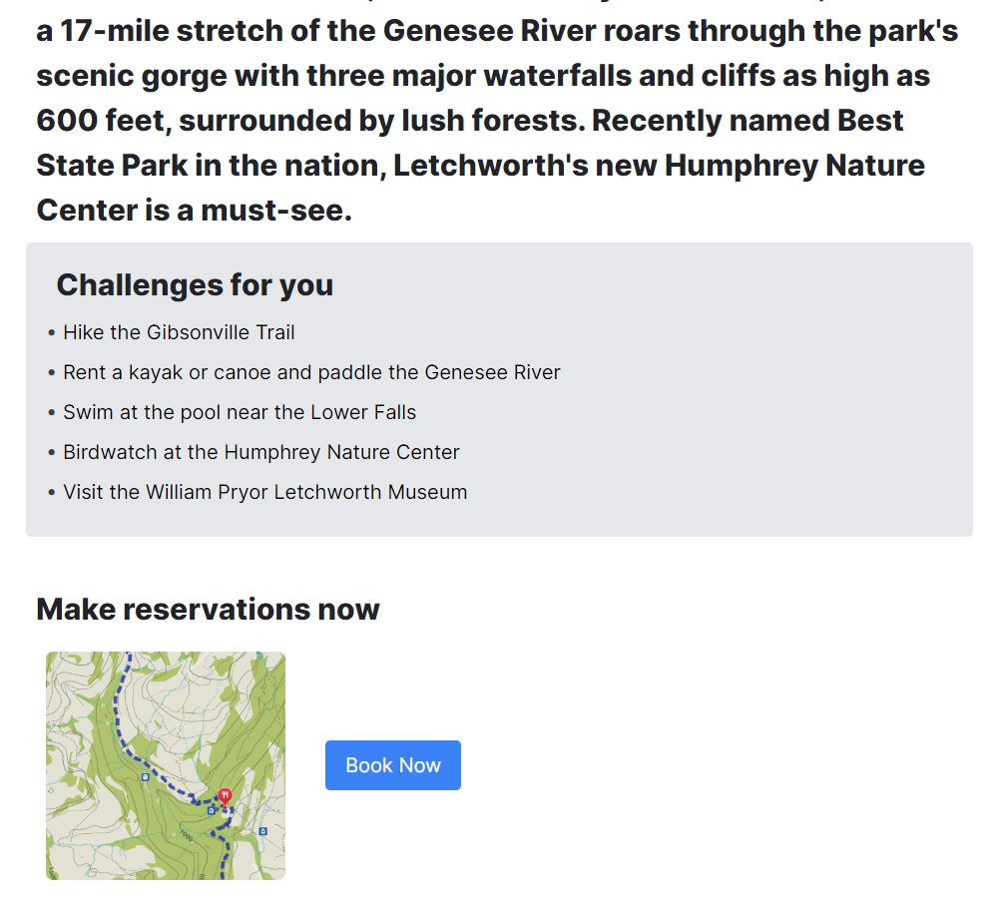

<h1 align="center">

</h1> 
# Terra Vista
TerraVista is your ultimate guide to local adventures. From hiking trails to kayaking spots, discover personalized recommendations and connect with a community of like-minded explorers. With social features and seamless reservations, TerraVista ensures every outdoor experience is effortless and unforgettable. The app was built with MERN stack and integrated Auth0 and Stripe

## 🔑 Key Feature

### Find Adventures Near your place

### Get fun challenges & Make quick reservations

### Find out other adventurers near you
 

## 🛠 Skills
node.js, react , tailwindcss, mongodb, Autho0, stripe payment 

## What's next for TerraVista
- More market research
- Improved social page
- better hike suggestions
